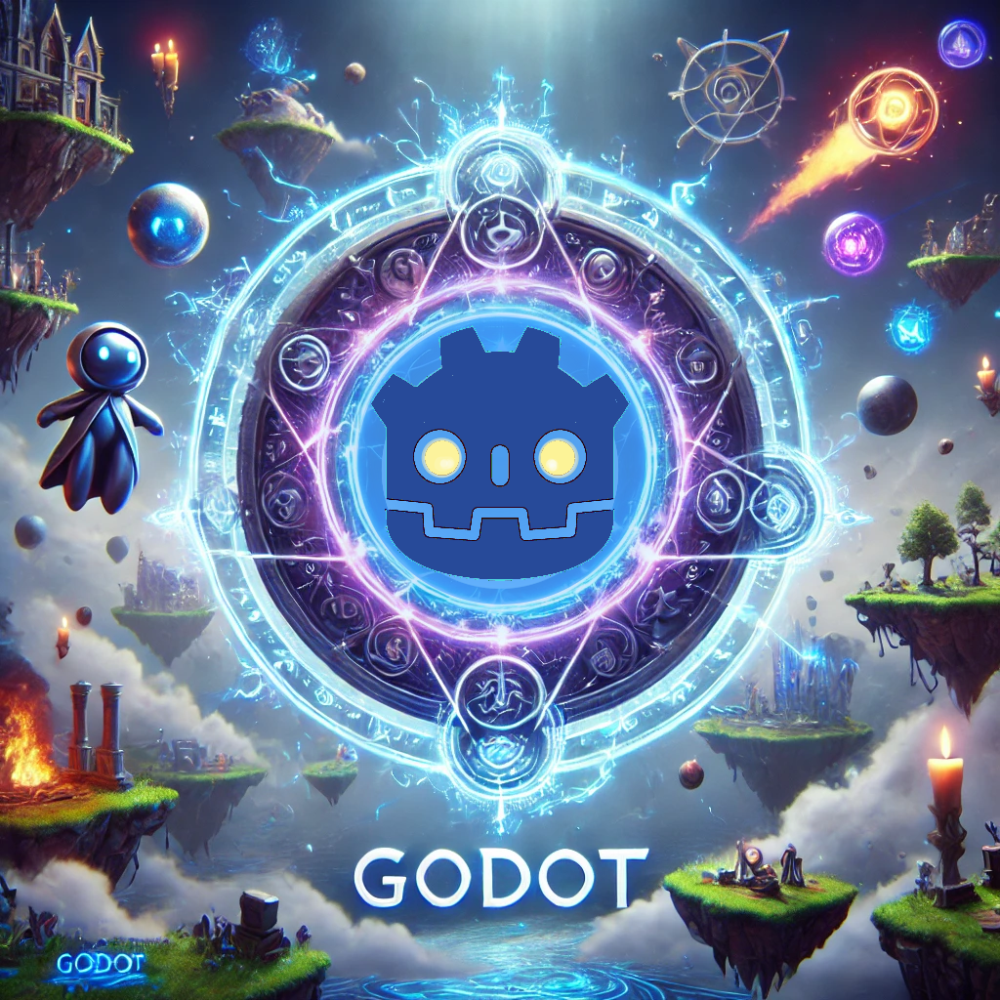

<p align="center">
    
</p>


<p align="center">
<a href="https://dio.me/"></a>
<a href="https://www.gnu.org/software/bash/" title="Go to Bash homepage"></a></p>

-------


<p align="center">

</p>

---

### **eBook: Guía Completa de Nodos 2D en Godot Engine**

---

#### **Introducción**

En esta guía, exploraremos los nodos 2D disponibles en Godot Engine, proporcionando una descripción concisa de cada uno y ejemplos prácticos de cómo pueden ser utilizados en proyectos de desarrollo de videojuegos.

---

### **Capítulo 1: Nodos de Control de Estructura**

---

#### **Node2D**
**Descripción:** `Node2D` es el nodo base para todas las instancias 2D. Este nodo proporciona funcionalidades básicas como la manipulación de posición, rotación y escala en el espacio 2D.

**Ejemplo de Uso:**
```gdscript
extends Node2D

func _ready():
    position = Vector2(100, 200) # Establecer la posición del nodo
```

---

#### **Sprite2D**
**Descripción:** `Sprite2D` es un nodo que muestra una imagen 2D (textura) en la pantalla. Es uno de los nodos más utilizados en el desarrollo de juegos 2D.

**Ejemplo de Uso:**
```gdscript
extends Sprite2D

func _ready():
    texture = load("res://ruta/a/tu/imagen.png") # Cargar y asignar una textura
```

---

#### **AnimatedSprite2D**
**Descripción:** `AnimatedSprite2D` es un nodo que permite reproducir una serie de imágenes (frames) como una animación.

**Ejemplo de Uso:**
```gdscript
extends AnimatedSprite2D

func _ready():
    frames = load("res://ruta/a/tu/animacion.tres") # Cargar la animación
    play("correr") # Reproducir la animación llamada "correr"
```

---

### **Capítulo 2: Nodos para Interacción y Entrada**

---

#### **Button**
**Descripción:** `Button` es un nodo que representa un botón interactivo en la interfaz de usuario.

**Ejemplo de Uso:**
```gdscript
extends Button

func _on_button_pressed():
    print("Botón presionado!")
```

---

#### **TouchScreenButton**
**Descripción:** `TouchScreenButton` es un nodo diseñado para crear botones táctiles que aparecen sobre la pantalla, especialmente útil en juegos móviles.

**Ejemplo de Uso:**
```gdscript
extends TouchScreenButton

func _on_button_pressed():
    print("Botón táctil presionado!")
```

---

### **Capítulo 3: Nodos para Física y Movimiento**

---

#### **KinematicBody2D**
**Descripción:** `KinematicBody2D` es un nodo que se utiliza para cuerpos en movimiento que requieren detección de colisiones, como personajes o enemigos.

**Ejemplo de Uso:**
```gdscript
extends KinematicBody2D

var velocidad = Vector2(200, 0)

func _physics_process(delta):
    var movimiento = velocidad * delta
    movimiento = move_and_slide(movimiento)
```

---

#### **Area2D**
**Descripción:** `Area2D` se utiliza para detectar la superposición de cuerpos 2D, útil para crear zonas de activación, como trampas o áreas de recolección de objetos.

**Ejemplo de Uso:**
```gdscript
extends Area2D

func _on_Area2D_body_entered(body):
    print("Cuerpo entró en el área")
```

---

### **Capítulo 4: Nodos de Dibujo y Efectos**

---

#### **Polygon2D**
**Descripción:** `Polygon2D` permite dibujar polígonos personalizados en el espacio 2D, que pueden ser utilizados para crear formas o efectos visuales.

**Ejemplo de Uso:**
```gdscript
extends Polygon2D

func _ready():
    polygon = PoolVector2Array([Vector2(0,0), Vector2(100,0), Vector2(50,100)])
```

---

#### **Line2D**
**Descripción:** `Line2D` es un nodo que permite dibujar líneas en el espacio 2D, útil para crear gráficos, bordes, o efectos como rayos láser.

**Ejemplo de Uso:**
```gdscript
extends Line2D

func _ready():
    points = PoolVector2Array([Vector2(0, 0), Vector2(100, 100)]) # Dibujar una línea diagonal
```

---

### **Capítulo 5: Nodos de Audio**

---

#### **AudioStreamPlayer2D**
**Descripción:** `AudioStreamPlayer2D` es un nodo que reproduce sonidos en el espacio 2D, con la capacidad de aplicar efectos de distancia y espacialización.

**Ejemplo de Uso:**
```gdscript
extends AudioStreamPlayer2D

func _ready():
    stream = load("res://ruta/a/tu/sonido.wav") # Cargar un archivo de audio
    play() # Reproducir el sonido
```

---

### **Conclusión**

Godot Engine ofrece una rica variedad de nodos 2D que permiten a los desarrolladores crear juegos complejos y visualmente atractivos con facilidad. Esta guía ha cubierto los nodos esenciales que cualquier desarrollador debería conocer, junto con ejemplos prácticos que pueden ser implementados en proyectos reales.

---

## 💻 Tecnologias utilizadas no projeto

- [ChatGPT](https://chat.openai.com/) 
- [MidJourney](https://www.midjourney.com/app/)
- [Lexica.art](https://lexica.art/) - para gerar imagens
- [Krita](https://krita.org/es/) - Para modificacion de imagenes

## 🧠 Prompts


ChatGPT：

|   Ação   |  prompt  |
| :------: | :------: |
| conteúdo | crea un resumen de cada nodo 2d de godot engine y coloca un ejemplo de uso de cada uno de ellos y presentalo en formato de ebook |

## ✨ Features

- Conteúdo gerado via ChatGPT
- Imagens do acervo público geradas via ChatGPT

## 🛠️ Instruções de execução

Utilize os prompts acima nas ferramentas sugeridas para gerar o material base e utilize uma ferramenta de edição de documentos como power point, libreoffice , indesign para diagramação, o passo a passo em vídeo pode ser conferido na plataforma da [DIO](https://dio.me).

## 👨‍💻 Expert

<p>
    
    <p>&nbsp&nbsp&nbspCusatti Andy<br>
    &nbsp&nbsp&nbsp
    <a href="https://github.com/macuare">
    GitHub</a>&nbsp;|&nbsp;
    <a href="https://www.linkedin.com/in/andy-cusatti/">LinkedIn</a>
&nbsp;|&nbsp;
    <a href="https://www.instagram.com">
    Instagram</a>
&nbsp;|&nbsp;</p>
</p>
<br/><br/>
<p>

---

⌨️ com 💜 por [Cusatti Andy](https://www.linkedin.com/in/andy-cusatti/)
